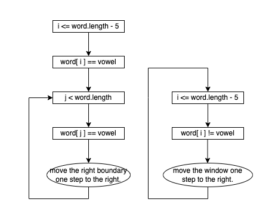
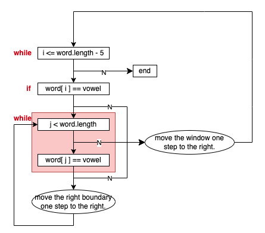

# Algorithms
## Windows
We need to adjust the window positions to ensure that all characters within the window are vowels. The process is quite simple:
1. If the left boundary of the window does not start with a vowel, shift the left boundary.
2. If the left boundary of the window begins with a vowel, initialize the right boundary and expand it until it reaches a consonant character.

# Skills
## Multiple While loops
The moving window concept becomes somewhat intricate due to the numerous conditions and loops involved. Initially, I considered employing two while-loops as depicted below:
.
Although two while-loops were implemented, two main issues arose:
1. The necessity to combine these loops into one flowchart.
2. Omission of the "N" path in our visualization.
Upon completion, the resultant diagram will resemble this:

Given these complexities arising from the "multiple while loops," I believe it's prudent to adopt a comprehensive flowchart approach.