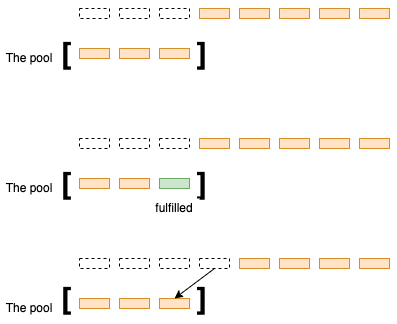
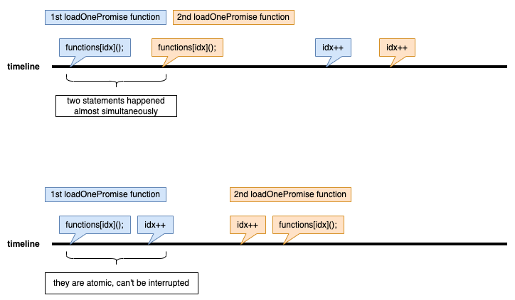

# Language
## JavaScript
### Promise Pool
**Execution in series**
This task requires the use of `promisePool` in the format `promisePool().then()`, so it must return a `promise`. The promise pool, akin to other pools, performs the following actions:
1. If `cnt < n`, it will continue to load more `promise` objects until there are none left.
2. It stops when the last `promise` is fulfilled.
However, since a `promise` is an asynchronous function, there are some unique considerations:
1. A `helper` function is required to load promises. A conventional while loop is not suitable because it might either:
   1. Cause a busy-waiting issue (as seen in `promisePool_wrong1`).
   2. Exit the loop before all promises fulfilled. If a `promise` is fulfilled after the loop, the loop doesn't resume (as seen in `promisePool_wrong2`).
Therefore, to emulate the behavior of a while loop, the `helper` function needs to be recursive.
2. Use `promise.then()` to invoke a `promise` object and potentially load a new `promise`.
3. After one `promise` completes its execution, the `helper` function is called recursively within the `then` block to load the next `promise`.
4. Once all promises are fulfilled, the `resolve` function is invoked to complete the `promisePool`. Note that invoking the `resolve` function will trigger the subsequent `then` function.

**Execution in parallel**
The problem can also be addressed using `Promise.all()`. Initially, the first `n` promises are invoked and executed. As each promise completes, it is replaced by the next one from the waiting list. This technique is implemented in `promisePool2`.



However, there's a caveat: "race conditions." When comparing `promisePool2` with `promisePool_wrong3`, the former uses a single statement `await functions[idx++]()` to fetch and increment the `idx`. In contrast, the latter splits the operation into two: `const currPromise = functions[idx](); followed by idx++;`. It's crucial to recognize that in the former approach, the reading and incrementing operations are atomic, meaning they occur without any interruptions.




# Caveat
## JavaScript
### Busy-waiting
Check `promisePool_wrong1`.

### Race conditions
Check `promisePool_wrong3`.

In JavaScript, even though we have asynchronous operations, the JavaScript runtime itself is single-threaded. The asynchronous operations don't really "run in parallel" in the traditional sense. Instead, they are managed by the event loop, which handles asynchronous operations one after another based on the order they finish.

However, even in this single-threaded environment, there's a concept known as "race conditions". This occurs when the output of a set of operations depends on the timing or order of execution.

Consider the following:

```javascript
let idx = 0;

const increment = async () => {
    let localIdx = idx;
    await someAsyncOperation(); // Let's assume this takes some variable amount of time.
    idx = localIdx + 1;
}

// Calling the function multiple times
increment();
increment();
increment();
```
Here, each call to increment fetches the value of idx and then does some asynchronous operation. Because these operations are asynchronous, the order in which they finish can vary. So, there's no guarantee about which call sets the value of idx last. This introduces a race condition.
