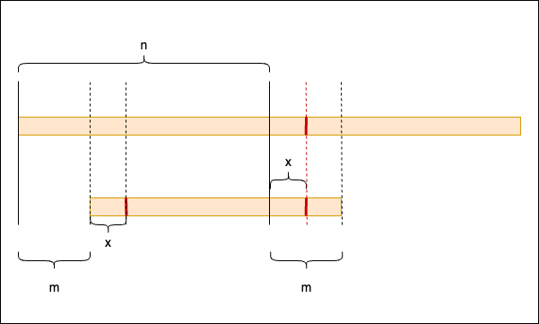

# Skills
## Repeat String Concatenation
This method is intriguing: we extend a string by appending it to its own end, creating a longer string. Subsequently, we verify the presence of the initial string within the center of this extended string. (In the code, we omit the first and last characters to ensure another occurrence of the original string in the middle.) We employ this visualization to illustrate the concept.

For a specific character, $string(x)$, a cyclic pattern emerges as $string(x) = string(x + m)$, where $x < m$. This indicates a looping structure within the string.