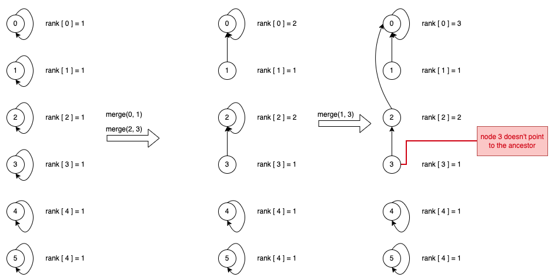

# Algorithms
## Union Find
The Union-Find algorithm can be categorized into two types: static, where the number of nodes remains constant, and dynamic, where nodes can be added during program execution. For the purpose of this discussion, we are addressing a dynamic Union-Find algorithm. However, understanding the static version can still provide valuable insights.

At its core, the Union-Find algorithm focuses on two main operations:

1. Find: This function identifies the ancestor of a given node. Utilizing a depth-first search, it traces the ancestor and subsequently updates every node along the path to directly reference this ancestor.
2. Merge: This function integrates one set (represented by its ancestor) into another.
   
The array `rank` is designed to represent the depth of the tree rooted at a given point. However, its accuracy can be compromised when the `find` function is used, leading to the collapse of a tree branch. A more accurate interpretation would be that the `rank` denotes the size of the node within the tree. Generally, trees with more nodes tend to be deeper.

# Caveats
## Father is not ancestor in Union Find
We maintain an array named `father` to track the immediate parent node or its ancestor node for each node. Note that sometimes the `father` array represents direct parents and not ancestors. Refer to the accompanying image for clarification.